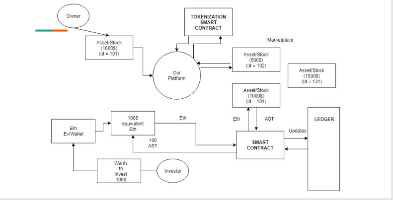
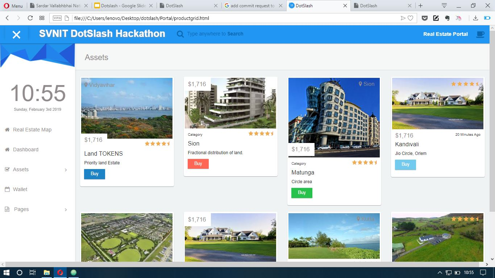
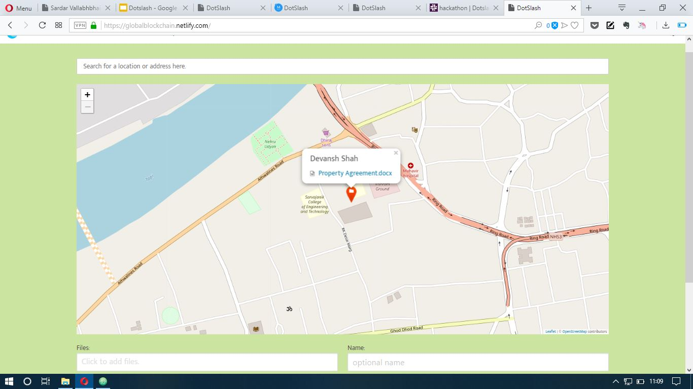

# Asset Tokenization and Real Estate Mapping

## Introduction

Crucial assets such as Ownership, Real Estate, Stocks are difficult to verify and physically transfer.Tokenization provides a faster way to solve this problem. A blockchain network is used to settle trades in a real-time manner saving time and locked up capital.

## Assumptions

Asset exists.
The lister is the current owner of the asset.
Note: These assumptions are just for the hackathon purpose, we can design and develop ways to validate these assumptions.

## Our Solution

We developed a blockchain-based Tokenization platform to liquidate assets like Stocks, Pre-IPO Equities, Land and Real Estate, Gold, etc. 
 
Our platform tokenizes such assets into equivalent worth of ERC20 tokens so that multiple investors can invest in same asset with any amount of money. 
 
Imagine, you can partly own/invest in a piece of land for just $100 or $10...
  
Our project's main aim is to provide faster liquidity of assets, thereby ensuring quick settlement of the transactions and a secure "Ownership Ledger"

## Features:

* Fast and Secure Processes
* Quick Liquidation of Assets
* Instant Settlement of Transactions
* Secure, Public, Immutable and Real Time - Ownership Provenance Ledger
* Material UI based Dashboard
* Investment using cryptocurrency
* Independent system. All processes backed by Smart Contracts

## Tech-Stack and Tools:

* Solidity
* js-uport
* Ethereum Blockchain
* Web3
* Truffle
* React

## Other Use Cases :

* Loan Syndication
* Crowdfunding
* Trading Intangible/Tangible/Fungible/Non-Fungible Assets
* ICOs  And many many more...

## Future Scope

* Verification of asset ownership through governmental bodies or organisations responsible to verify whether the asset coming into the platform matches with the current user.

## Conclusion

Tokenization promises to change how broad asset classes are bought and sold, democratizing the process of owning everything from ideas to paintings. Blockchains offer a streamlined alternative to traditional paper markets and a unique way of sharing ownership of unique objects like painting or real estate.
Via the blockchain, ownership is slowly taking on new meaning.
